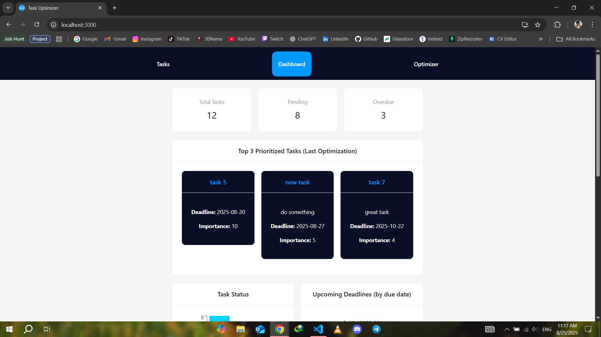

# AI Task Optimizer

> AI-powered task management and optimization platform, built with React, Node.js, and Python (FastAPI).

## Table of Contents

- [General Info](#general-information)
- [Technologies Used](#technologies-used)
- [Screenshots](#screenshots)
- [Usage](#usage)
- [Project Status](#project-status)
- [Room for Improvement](#room-for-improvement)
- [Acknowledgements](#acknowledgements)
- [Contact](#contact)

## General Information

AI Task Optimizer is a full-stack web application that helps users manage and optimize their daily tasks using AI-driven algorithms. It demonstrates strong data structures, algorithms, and systems design, and was built as a portfolio project for the Full Stack Developer (AI-Enabled) role at Alexander Innovation Centre.

- Built to showcase rapid prototyping, scalable architecture, and AI integration.
- Features a modern React frontend, Node.js/Express API, and a Python FastAPI optimizer service.
- Designed for clarity, reliability, and real-world impact.

## Technologies Used

- React.js
- Ant Design
- Recharts
- Node.js
- Express.js
- MongoDB & Mongoose
- Python 3.12
- FastAPI
- Pydantic
- Axios
- Day.js
- Docker (recommended for deployment)
- Git & GitHub

## Screenshots

## Usage

AI Task Optimizer allows users to:

- Add, edit, and delete tasks with deadlines and importance levels.
- View analytics and statistics on task completion and optimization history.
- Optimize task order using a custom AI algorithm (Python FastAPI backend).
- Experience a clean, responsive UI with real-time updates.

### System Architecture

- **Frontend:** React app for user interaction and visualization.
- **Backend API:** Node.js/Express for RESTful endpoints and MongoDB storage.
- **AI Optimizer:** Python FastAPI service for task prioritization and optimization logic.

Data flows from the frontend to the backend API, which stores and retrieves tasks. When optimization is requested, the backend calls the Python service, which returns an optimized task order based on deadlines and importance.

## Project Status

Project is: Complete (MVP)

- All core features implemented and tested.
- Ready for demonstration and further extension.

## Room for Improvement

- Add more options for editing tasks.
- Better styling changes.
- Add authentication and user accounts.
- Enhance the optimization algorithm (e.g., integrate ML models or more advanced scheduling logic).
- Add cloud deployment scripts (Docker Compose, CI/CD pipeline).
- Improve test coverage (unit/integration tests for all services).
- Add more visualizations and export options.

## Acknowledgements

- Inspired by the Alexander Innovation Centre job description and requirements.
- Thanks to open-source contributors in the React, Node.js, and Python communities.

## Contact

Created by Behbod Babai - feel free to contact me via email!
my email: behibabai@gmail.com

<!-- Optional -->
<!-- ## License -->
<!-- This project is open source and available under the ... License. -->
